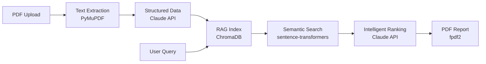

# doc-ai-assistant

**AI-powered document assistant — upload PDFs, extract structured data, search products semantically, generate proposals. Works with any product catalog.**

`6 core features` | `RAG-powered search` | `Demo mode included`


---

## Demo

<!-- Add screenshot here:  -->

> **Try it now:** The app works completely without an API key using pre-loaded demo data.
> For live AI features, enter your Anthropic API key in the sidebar.

---

## Features

| Feature | Description | Technology |
|---------|-------------|------------|
| **PDF Data Extraction** | Upload any PDF, extract structured technical data as JSON | Claude Sonnet 4.6 + PyMuPDF |
| **Semantic Product Search** | Natural language queries against your product catalog | sentence-transformers + ChromaDB |
| **NFC Configuration Simulator** | Interactive device configuration with live JSON output | Parametric model |
| **Energy Savings Estimation** | ML-based annual savings prediction (kWh, EUR, CO2) | scikit-learn RandomForest |
| **Model Comparison Dashboard** | Systematic Claude vs. Llama-3.3-70B evaluation | Side-by-side analysis |
| **PDF Report Generation** | Compile all results into a downloadable PDF | fpdf2 |

---

## Architecture



See [docs/architecture.md](docs/architecture.md) for detailed model selection rationale.

---

## Quick Start

### 1. Clone & Install

```bash
git clone https://github.com/YOUR_USERNAME/doc-ai-assistant.git
cd doc-ai-assistant
pip install -r requirements.txt
```

### 2. Configure (optional)

```bash
cp .env.example .env
# Edit .env and add your ANTHROPIC_API_KEY (optional — demo works without)
```

### 3. Run

```bash
streamlit run app.py
```

Open `http://localhost:8501` in your browser.

### 4. Run Tests

```bash
pytest tests/ -v
```

---

## Demo Mode

The app is fully functional **without an API key**:

- All 6 tabs work with pre-loaded demo data
- Click "Load demo data" / "Load demo search" to explore
- For live AI features: enter your Anthropic API key in the sidebar
- Cost control: max 20 API calls per session with live cost tracker

---

## Customization

### Use Your Own Product Catalog

1. Edit `products.json` following the existing schema:

```json
{
  "products": [
    {
      "id": "YOUR-PRODUCT-ID",
      "name": "Product Name",
      "category": "Product Category",
      "description": "Product description for semantic search",
      "specs": {
        "airflow_m3h": 100,
        "sound_pressure_dba": {"low": 26, "high": 47},
        "nfc_configurable": false
      },
      "use_cases": ["Office", "Warehouse"],
      "highlights": ["Feature 1", "Feature 2"]
    }
  ]
}
```

2. Update `demo_data/` files to match your products
3. Customize `prompts/` for your domain terminology
4. Run tests to verify: `pytest tests/test_integration.py::TestProductCatalog -v`

### Adapt Prompts

Edit the prompt templates in `prompts/`:
- `extraction_system.md` — Controls what fields are extracted from PDFs
- `matching_system.md` — Controls how products are ranked and scored
- `report_system.md` — Controls the PDF report format

---

## Tech Stack

| Component | Technology | Why |
|-----------|-----------|-----|
| Frontend | Streamlit | Fastest Python UI framework for prototyping |
| LLM | Claude Sonnet 4.6 (Anthropic API) | Best JSON reliability + multilingual support |
| Embeddings | sentence-transformers/all-MiniLM-L6-v2 | Local, free, no vendor lock-in |
| Vector Store | ChromaDB (in-memory) | Embedded, no server needed |
| ML | scikit-learn RandomForestRegressor | Interpretable, robust with small data |
| PDF Parsing | PyMuPDF | Fast, reliable, open source |
| PDF Generation | fpdf2 | Lightweight PDF generation |
| Deployment | Streamlit Community Cloud | Free, 1-click from GitHub |

---

## Project Structure

```
doc-ai-assistant/
├── app.py                  # Main Streamlit application
├── products.json           # Product catalog (swap with your own)
├── prompts/                # LLM prompt templates
│   ├── extraction_system.md
│   ├── matching_system.md
│   └── report_system.md
├── demo_data/              # Pre-built demo results
│   ├── demo_extraction_result.json
│   ├── demo_search_results.json
│   └── demo_comparison.json
├── tests/                  # Unit + integration tests
│   ├── test_app.py
│   └── test_integration.py
├── docs/                   # Documentation
│   └── architecture.md
├── .streamlit/config.toml  # Streamlit theme config
├── .devcontainer/          # GitHub Codespaces support
├── requirements.txt
├── .env.example
└── README.md
```

---

## Testing

99 automated tests covering:
- Unit tests (core functions)
- Integration tests (data consistency, plausibility)
- Semantic search tests (ChromaDB returns correct results)
- Energy model plausibility checks

```bash
# All tests
pytest tests/ -v

# Only live API tests (requires ANTHROPIC_API_KEY)
ANTHROPIC_API_KEY=sk-ant-... pytest tests/ -v -m live
```

---

## Contributing

See [CONTRIBUTING.md](CONTRIBUTING.md) for guidelines.

## License

[MIT](LICENSE)
