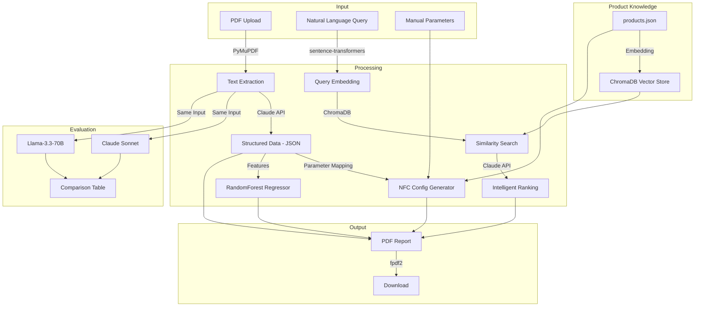

# Architecture & Model Selection

## System Overview

## Model Selection Rationale

### LLM: Claude Sonnet 4.6 (Primary)
- **Strength:** Most reliable JSON output format, excellent multilingual competence
- **Trade-off:** Higher cost than open-source, API dependency
- **Alternative evaluated:** Llama-3.3-70B via Groq — faster/cheaper, but less reliable for structured extraction

### Embeddings: sentence-transformers/all-MiniLM-L6-v2
- **Strength:** Local, free, no API latency, no vendor lock-in
- **Trade-off:** Not specialized for domain-specific HVAC terminology
- **Alternatives:** voyage-3, text-embedding-3-large — better quality, but API-dependent

### Vector Store: ChromaDB
- **Strength:** In-memory, no server, persistent-capable, Python-native
- **Trade-off:** Not scalable to millions of documents
- **Sufficient:** 15 products → In-memory ChromaDB is optimal

### ML: RandomForest Regressor
- **Strength:** Interpretable (feature importance), robust with small datasets (n=60), no overfitting risk
- **Trade-off:** No extrapolation beyond training range
- **Why not Neural Networks:** With n=60 synthetic samples, any NN would be massively overfitted

### PDF Parsing: PyMuPDF
- **Strength:** Fastest Python library, reliable, open source
- **Alternative:** pdfplumber (better table support), but slower

## Data Flow

1. **PDF Upload** → PyMuPDF extracts raw text
2. **Claude API** → Extracts structured JSON from raw text
3. **ChromaDB** → Products are embedded and indexed at startup
4. **Semantic Search** → User query is embedded, compared against product vectors
5. **Claude Ranking** → Top candidates are re-ranked by LLM with reasoning
6. **Energy Model** → RandomForest predicts annual savings from room parameters
7. **PDF Report** → All results compiled into downloadable PDF via fpdf2
